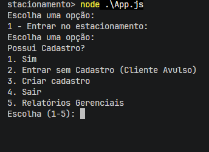

# Sistema-estacionamento

  Primeiramente, abra um terminal no diretório do projeto e rode:
### `npm install`
  para instalar as dependências do projeto.

### e `node .\App.js`
para inicializar o projeto.

Após a execução, este deverá ser o resultado no seu navegador:

# Introdução
Projeto feito com Node.JS que simula um sistema de estacionamento, que controla entrada e saída de carros, cadastros de placas e relatórios gerenciais.
